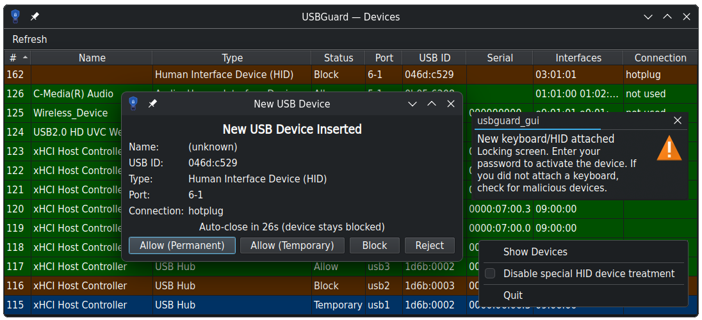

# USBGuard GUI

[](https://copr.fedorainfracloud.org/coprs/dgunchev/usbguard_gui/package/usbguard_gui/)

A vibe coded KDE/Qt system tray GUI for [USBGuard](https://usbguard.github.io/).

Monitors USB device insertions and lets you Allow, Block or Reject devices
through desktop notifications and a device management window.




## How It Works

### Startup

On launch, the application connects to the USBGuard daemon via D-Bus and monitors the desktop screensaver state via
session D-Bus. The app runs as a system tray icon with tooltip showing connection status.

Click the tray icon to open the device list showing all connected USB devices. Click again to close.

### Device Detection Flow

1. USBGuard daemon blocks an unknown USB device.
2. App receives a `device_presence_changed` signal from D-Bus.
3. Handling depends on the situation:
  - **Device is already allowed** by an existing rule — no UI, nothing to do.
  - **Device has at least one HID interface** — see *HID Devices* below.
  - **Screen is locked** (non-HID device) — the device is deferred (see *Screensaver Integration* below).
  - **Anything else** — a popup dialog appears with options:
    - **Allow (Permanent)** — allow device and create persistent rule.
    - **Allow (Temporary)** — allow device until it's disconnected.
    - **Block** — keep device blocked.
    - **Reject** — electrically disconnect the device.

### HID Devices

Any device that exposes at least one HID interface — a pure keyboard/mouse **or** a composite
device such as HID + Mass Storage — is handled specially to defend against "BadUSB"-style
keystroke-injection attacks:

1. A tray warning appears: *"New keyboard/HID attached"*.
2. After a short delay (4 seconds) the device is temporarily allowed and the screen is locked —
   provided the device is still connected. If it was unplugged before the delay expired, the
   lock is skipped.
3. You must enter your password with the newly-attached device to unlock it, which prevents
   an unattended unlocked machine from being hijacked by an injected keystroke device.

This flow only triggers for devices inserted while the screen is *unlocked*. An HID device
plugged in while the screen is already **locked** is instead temporarily allowed immediately —
without the warning/delay/lock dance — so you can use a newly-attached keyboard to unlock the
machine. The temporary allow lasts only until the device is unplugged.

The entire HID special-treatment flow can be disabled via **Disable special HID device treatment**
in the tray right-click menu (persisted in `~/.config/usbguard_gui/general.conf`). When disabled,
HID devices receive the same prompt dialog as any other device — more secure, but a newly-attached
keyboard cannot be used to unlock the screen.

### Screensaver Integration

- When the screen locks: the app tracks all device insertions that occur while locked.
- When the screen unlocks: displays a notification listing all devices that connected during absence.
- Opens an action dialog for each pending device so you can decide what to do.

### Device List Window

- Shows all currently connected USB devices with their status.
- Displays device name, ID, hash and class.
- Status column: **Allow** = permanent rule, **Temporary** = allowed until unplugged, **Block** / **Reject** as set.
- Live updates via D-Bus signals (refreshes on device events).
- Supports applying policy actions directly.
- Indicates which devices have permanent allow rules.

## Requirements

- Python 3.10+
- USBGuard daemon running with D-Bus interface enabled
- A desktop environment with system tray support (KDE Plasma, GNOME, etc.)

## Installation

### Fedora

On Fedora installing the RPM package will start the app on session start in KDE.
Make sure to generate the USBGuard policy or all your USB devices will be unavailable.

```bash
# Enable the COPR repository
dnf copr enable dgunchev/usbguard_gui

# USB Guard GUI, it pulls USBGuard itself, the service and dbus.
sudo dnf -y install usbguard_gui

# Generate initial policy to allow currently attached USB devices.
# No idea why USBGuard does not do that by itself.
sudo usbguard generate-policy | sudo tee /etc/usbguard/rules.conf

# Start both the main and dbus services. The "usbguard-dbus.service" is enabled by the RPM %post-install scriptlet.
systemctl enable --now usbguard.service usbguard-dbus.service
```

At this point either run `usbguard_gui` or logout and login to get it (KDE only).
Should work in other desktops with system tray support too.
Contributions are welcome.

### Fedora Auto-Update

On new GitHub release tag, Fedora COPR rebuilds the package and the desktop will notify you about the update.
Uppon RPM update the USBGuard GUI application will detect the package update and relaunch itself with the new version —
the tray icon will briefly disappear and reappear with the updated code.

### Generic

Install USBGuard, configure it and start the main and dbus services.
Install the app itself.

```bash
uv tool install .
```

Add the policy kit rules.

```bash
sudo cp rpm/70-usbguard_gui.rules /usr/share/polkit-1/rules.d/
```

You may also want to install the `dist/usbguard_gui*.desktop' files and the icon.

Start the GUI.

```bash
usbguard_gui
```

## Architecture

- **UI Framework**: PyQt6
- **D-Bus Integration**: dbus-fast with QThread-based asyncio event loop
- **Communication Pattern**: Asynchronous operations return results via Qt signals
- **Key Components**:
  - `app.py` — Main tray application and signal handlers.
  - `dbus_client.py` — USBGuard daemon communication.
  - `screensaver.py` — Screensaver state monitoring.
  - `device_list.py` — Device management window.
  - `device_dialog.py` — Device action dialog.

## Development

```bash
make                  # Show all make targets
make run              # Run the application from the source tree
make release V=1.0.0  # Create new release
```

## Configuration

The configuration files can be found in `~/.config/usbguard_gui` (`$XDG_CONFIG_HOME`),
as defined in the XDG specifications.

## Credits

- Inspired by [usbguard-gnome](https://github.com/6E006B/usbguard-gnome) — a GNOME tray applet for USBGuard that
  pioneered several UX ideas adopted here (HID lock-screen behaviour, screensaver awareness, device dialog flow).
- Planned with [Claude Opus](https://claude.ai/claude-code) (Anthropic).
- Implemented with [Claude Sonnet](https://claude.ai/claude-code) (Anthropic).
- Infrastructure improvements by [big-pickle/OpenCode](https://opencode.ai).

## License

GPL-2.0-or-later
