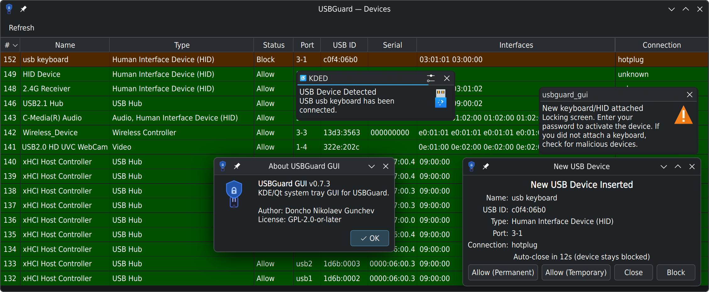

# USBGuard GUI

[](https://copr.fedorainfracloud.org/coprs/dgunchev/usbguard_gui/package/usbguard_gui/)

A vibe coded KDE/Qt system tray GUI for [USBGuard](https://usbguard.github.io/).

Monitors USB device insertions and lets you Allow, Block or Reject devices
through desktop notifications and a device management window.




## How It Works

### Startup

On launch, the application connects to the USBGuard daemon via D-Bus and monitors the desktop screensaver state via
session D-Bus. The app runs as a system tray icon with tooltip showing connection status.

Click the tray icon to open the device list showing all connected USB devices. Click again to close.

### Device Detection Flow

1. USBGuard daemon blocks an unknown USB device.
2. App receives a `device_presence_changed` signal from D-Bus.
3. Handling depends on the situation:
  - **Device is already allowed** by an existing rule — no UI, nothing to do.
  - **Device has at least one HID interface** — see *HID Devices* below.
  - **Screen is locked** (non-HID device) — the device is deferred (see *Screensaver Integration* below).
  - **Anything else** — a popup dialog appears with these buttons:
    - **Allow (Permanent)** — allow the device and create a persistent rule.
    - **Allow (Temporary)** — allow the device until it is disconnected.
    - **Block** — keep the device blocked.
    - **Close** — applies **Reject**: the device is electrically disconnected and
      USBGuard forgets it. Despite the label this is a decision, not a dismissal.

  `Close` is the default button, so **Enter** applies Reject rather than an allow.
  Letting the dialog time out (30 s) is different: no action is applied at all and
  the device simply stays blocked. If you want "do nothing for now", let it time
  out or pick **Block**.

### HID Devices

Any device that exposes at least one HID interface — a pure keyboard/mouse **or** a composite
device such as HID + Mass Storage — is handled specially to defend against "BadUSB"-style
keystroke-injection attacks:

1. A tray warning appears: *"New keyboard/HID attached"*.
2. After a short delay (5 seconds) the screen is locked, and **only once the lock is
   confirmed** is the device temporarily allowed — never the other way round. If the device
   was unplugged before the delay expired, the lock is skipped.
3. You must enter your password with the newly-attached device to unlock it, which prevents
   an unattended unlocked machine from being hijacked by an injected keystroke device.

This flow only triggers for devices inserted while the screen is *unlocked*. An HID device
plugged in while the screen is already **locked** is instead temporarily allowed immediately —
without the warning/delay/lock dance — so you can use a newly-attached keyboard to unlock the
machine. The temporary allow lasts only until the device is unplugged.

The entire HID special-treatment flow can be disabled via **Disable special HID device
treatment** in the tray right-click menu (persisted in `~/.config/usbguard_gui/general.conf`).
When disabled, HID devices get the same prompt dialog as any other device: nothing is
allowed automatically, **but the lock-first guarantee goes with it** — you can then allow
a keyboard while the session stays unlocked, and a newly-attached keyboard cannot be used
to unlock the screen. "Different", not "more secure": keep the treatment enabled unless
you specifically want prompt-driven HID handling.

### When Screen Locking Is Not Possible

The lock-first design assumes the screen *can* be locked. Two situations break that
assumption and the app refuses to act rather than pretending:

- **No screen-lock service** (the `org.freedesktop.ScreenSaver` service is unreachable —
  a locker-less or unusual session). The tray shows *"Screen locking unavailable"* and
  **all allow/deny actions are disabled** — in the dialog and in the device list. Allowing
  a keyboard without being able to lock first would hand an attacker an unlocked session,
  so the app will not touch the policy at all. Devices stay blocked by USBGuard's own
  policy. The tray announces it again when locking becomes available.
- **A logind idle/block inhibitor is held** (a `dnf`/`rpm` transaction, a *"Prevent screen
  lock"* toggle, `systemd-inhibit --what=idle`, …). The auto-allow-then-lock flow is
  skipped — locking would be a no-op, so the app does not claim it happened — and the HID
  device falls through to the normal prompt path, where it is **not** auto-allowed.

In both cases the failure direction is the safe one: the device stays blocked.

### Screensaver Integration

- When the screen locks: the app tracks all device insertions that occur while locked.
- When the screen unlocks: displays a notification listing all devices that connected during absence.
- Opens an action dialog for each pending device so you can decide what to do.

### Device List Window

- Shows all currently connected USB devices with their status.
- Displays device name, ID, hash and class.
- Status column: **Allow** = permanent rule, **Temporary** = allowed until unplugged, **Block** / **Reject** as set.
- Live updates via D-Bus signals (refreshes on device events).
- Supports applying policy actions directly.
- Indicates which devices have permanent allow rules.

## Requirements

- Python 3.10+
- USBGuard daemon running with D-Bus interface enabled
- A desktop environment with system tray support (KDE Plasma, GNOME, etc.)

## Installation

### Read this before installing the polkit rule

The app applies USBGuard policy over D-Bus, and polkit gates those calls. The shipped
`rpm/70-usbguard_gui.rules` — installed by the RPM to `/usr/share/polkit-1/rules.d/`, or
copied by hand to `/etc/polkit-1/rules.d/` on a manual install — grants **without a password**:

- `org.usbguard.Devices1.applyDevicePolicy` — allow / block / reject any device
- `org.usbguard.Policy1.listRules`, `appendRule`, `removeRule`, `getRule` — read and rewrite
  the entire permanent ruleset
- `org.usbguard.Devices1.listDevices`

The match condition is `subject.active == true && subject.local == true` — that is **every
logged-in local user, not only administrators**. On a single-user laptop that is the intended
convenience: one click per device, no polkit prompt. On a shared or multi-user machine it means
any local user can authorize any USB device and edit the permanent policy, which defeats the
point of gating USB access at all.

- **Single-user machine:** the rule as shipped is fine.
- **Multi-user machine:** tighten it before installing — the file's own header shows the edit
  (`subject.active == true` → `subject.isInGroup("wheel")`).
- **No rule at all:** polkit falls back to USBGuard's default and every action prompts for an
  admin password. The app still works, it just prompts.

Splitting this into a permissive and a strict policy subpackage is tracked for 1.0 in `TODO.md`.

### Fedora

On Fedora installing the RPM package will start the app on session start in KDE.
On first install the RPM generates an initial USBGuard policy if `/etc/usbguard/rules.conf` is missing or empty.

```bash
# Enable the COPR repository
dnf copr enable dgunchev/usbguard_gui

# USB Guard GUI, it pulls USBGuard itself, the service and dbus.
sudo dnf -y install usbguard_gui

# Generate initial policy to allow currently attached USB devices.
# This is needed only if the RPM package failed to generate one.
sudo usbguard generate-policy | sudo tee /etc/usbguard/rules.conf

# Start both the main and dbus services. The "usbguard-dbus.service" is enabled by the RPM %post-install scriptlet.
systemctl enable --now usbguard.service usbguard-dbus.service
```

At this point either run `usbguard_gui` or logout and login to get it (KDE only).
Should work in other desktops with system tray support too.
Contributions are welcome.

### Fedora Auto-Update

On new GitHub release tag, Fedora COPR rebuilds the package and the desktop will notify you about the update.
Uppon RPM update the USBGuard GUI application will detect the package update and relaunch itself with the new version —
the tray icon will briefly disappear and reappear with the updated code.

### Generic

Install USBGuard, configure it and start the main and dbus services.
Install the app itself.

```bash
uv tool install .
```

Add the polkit rule — read *Read this before installing the polkit rule* above first; the
definition grants passwordless USB control to every active local user.

```bash
sudo cp rpm/70-usbguard_gui.rules /etc/polkit-1/rules.d/
```

(`/etc/polkit-1/rules.d/` is the admin-authored location and takes precedence over the
packaged `/usr/share/polkit-1/rules.d/`, so a tightened copy there overrides the RPM's rule.)

You may also want to install the `dist/usbguard_gui*.desktop' files and the icon.

Start the GUI.

```bash
usbguard_gui
```

## Architecture

- **UI Framework**: PyQt6
- **D-Bus Integration**: dbus-fast with QThread-based asyncio event loop
- **Communication Pattern**: Asynchronous operations return results via Qt signals
- **Key Components**:
  - `app.py` — Main tray application and signal handlers.
  - `dbus_client.py` — USBGuard daemon communication.
  - `dbus_common.py` — Shared QThread + asyncio worker base for both D-Bus subsystems.
  - `screensaver.py` — Screensaver / logind lock-state and inhibitor monitoring.
  - `device.py` — Device model and USBGuard rule-string parsing.
  - `device_list.py` — Device management window.
  - `device_dialog.py` — Device action dialog.
  - `settings.py` — Settings seam (`SettingsProtocol`) and the QSettings-backed store.
  - `introspection/` — Bundled D-Bus introspection XML (ships in the wheel).

Architecture details: [docs/DESIGN.md](docs/DESIGN.md). Past audit and review
reports live in `docs/`.

## Development

```bash
make                  # Show all make targets
make run              # Run the application from the source tree
make release V=1.0.0  # Create new release
```

## Configuration

The configuration files can be found in `~/.config/usbguard_gui` (`$XDG_CONFIG_HOME`),
as defined in the XDG specifications.

## Credits

- Inspired by [usbguard-gnome](https://github.com/6E006B/usbguard-gnome) — a GNOME tray applet for USBGuard that
  pioneered several UX ideas adopted here (HID lock-screen behaviour, screensaver awareness, device dialog flow).
- Planned with [Claude Opus](https://claude.ai/claude-code) (Anthropic).
- Implemented with [Claude Sonnet](https://claude.ai/claude-code) (Anthropic).
- Infrastructure improvements by [big-pickle/OpenCode](https://opencode.ai).
- Manu bugs and improvements by [Qwen3.8-27B](https://huggingface.co/Qwen/Qwen3.8-27B) with [pi](https://pi.dev/) + [thinking fixes](https://github.com/soster/qwen38-thinking-levels).
- v0.8.0 release engineering by [Qwen3.8-Flash-Next](https://huggingface.co/Qwen/Qwen3.8-Flash-Next) served by [halogen-flash-server](https://github.com/peonist-ai/halogen-flash-server), with [pi](https://pi.dev/).

## License

GPL-2.0-or-later
