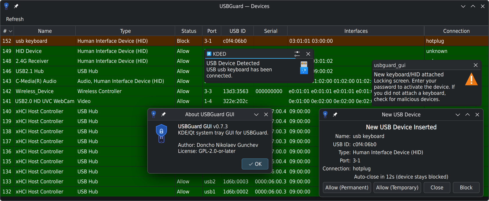

# USBGuard GUI

[](https://copr.fedorainfracloud.org/coprs/dgunchev/usbguard_gui/package/usbguard_gui/)

A vibe coded KDE/Qt system tray GUI for [USBGuard](https://usbguard.github.io/).

Monitors USB device insertions and lets you Allow or Block devices, permanently or until unplugged
through desktop notifications and a device management window.




## How It Works

### Startup

On launch, the application connects to the USBGuard daemon via D-Bus and monitors the desktop screensaver state via
session D-Bus. The app runs as a system tray icon with tooltip showing connection status.

Click the tray icon to open the device list showing all connected USB devices. Click again to close.

### Device Detection Flow

1. USBGuard daemon blocks an unknown USB device.
2. App receives a `device_presence_changed` signal from D-Bus.
3. Handling depends on the situation:
  - **Device is already allowed** by an existing rule — no UI, nothing to do.
  - **Device has at least one HID interface** — see *HID Devices* below.
  - **Screen is locked** (non-HID device) — the device is deferred (see *Screensaver Integration* below).
  - **Anything else** — a popup dialog appears with these buttons:
    - **Allow Always** — allow the device and create a persistent rule.
    - **Allow Once** — allow the device until it is disconnected, and **remove**
      any permanent rule it currently has.
    - **Block Once** — keep the device blocked, and remove any permanent rule it
      currently has.
    - **Block Always** — keep the device blocked and persist that as a rule.
    - **Close** — dismiss without deciding. Nothing is applied, same as **Escape**.

  `Close` is the default button, so **Enter** dismisses rather than allowing.
  Letting the dialog time out (30 s) does the same: no action is applied at all
  and USBGuard's current live state is left alone.

**Every action states whether it is durable.** The invariant is that a device's
permanent rule always reflects your last *durable* decision — or there is none.
`Always` writes the rule; `Once` **deletes** it rather than merely declining to
write, so an old rule cannot survive the click and silently re-assert at the next
reboot. **Reject is not offered.** A persisted `reject` rule removes the device on
sight, so it never appears in the device list and there is no way back from the app
until a rule editor exists; the code refuses to write one.

Legacy duplicate rules for the same device and topology are consolidated by
*Always*, so an older duplicate Allow cannot shadow a new Block. Rules for other
topologies and broader class policy are left intact.

Durable choices are processed in order, including each rule read, removal,
replacement and rollback. A later choice therefore sees the earlier choice's
completed policy, rather than racing it with an outdated snapshot.

**A durable decision that fails is reported.** *Always* writes the rule to
`/etc/usbguard/rules.conf` as a separate step from making the device live. If that
write is denied or fails, the device stays in the state you asked for **only until
it is unplugged**, and the tray raises a *"Permanent rule not saved"* warning saying
so. The mirror case exists too: if *Once* cannot remove the standing rule, nothing
was applied at all and the tray raises *"Temporary decision not applied"*. A device
whose policy had grown several rules can fail halfway — some removed, some not — and
that is reported separately as *"Temporary decision not applied — policy partly
changed"*, because there the stored policy really did move and is worth checking by
hand. If the clear succeeds but the live *Allow Once* or *Block Once* fails, the tray
reports *"Temporary decision not applied — permanent rules removed"* and names the
rules already deleted. The stored policy has changed, but the requested live state
was not applied. When no rule was removed, the warning is simply *"Temporary decision
not applied"*. If you see any of these, the decision needs to be made again (or the polkit
rule fixed) — otherwise the state is not what you clicked.

**A device that disconnects while you are deciding keeps its dialog.** Hardware that
re-enumerates on its own — IR blasters, modems, anything that resets when it is
configured — can vanish before you finish reading the prompt. The dialog stays open
and says so, and your click still counts: *Always* writes the rule immediately (a
permanent rule needs no live device, and it governs the next appearance), while
*Once* is held and applied the moment the device comes back in the same USB topology,
using its current device ID and rule. Parent hash and port are part of the identity:
identical hubs can share a device hash, so moving to another port requires a new
decision rather than inheriting another device's dialog or held choice. An existing
dialog updates on every return, including when the device returns already allowed.
The one exception is the HID contract below: a held *Allow* for a device with a
HID interface hands the live authorization back to the lock-first flow rather
than bypassing it. That held *Once* does not carry its other half there — no permanent
rule is cleared, because
dropping one on the strength of a click made while the device was away is the same
stale-click problem the lock exists to refuse. The tray raises *"Held Allow cleared
no permanent rule"* so the difference is visible, and you can decide again with
the device connected. This also applies while locking is inhibited or unavailable:
the held Allow never becomes an automatic unlocked authorization. The normal prompt
requires a fresh click when locking is inhibited; its actions remain disabled when
locking is unavailable. No held choice changes policy while locking is unavailable.

### HID Devices

Any device that exposes at least one HID interface — a pure keyboard/mouse **or** a composite
device such as HID + Mass Storage — is handled specially to defend against "BadUSB"-style
keystroke-injection attacks:

1. A tray warning appears: *"New keyboard/HID attached"*.
2. After a short delay (5 seconds) the screen is locked, and **only once the lock is
   confirmed** is the device temporarily allowed — never the other way round. If the device
   was unplugged before the delay expired, the lock is skipped.
3. You must enter your password with the newly-attached device to unlock it, which prevents
   an unattended unlocked machine from being hijacked by an injected keystroke device.

This flow only triggers for devices inserted while the screen is *unlocked*. An HID device
plugged in while the screen is already **locked** is instead temporarily allowed immediately —
without the warning/delay/lock dance — so you can use a newly-attached keyboard to unlock the
machine. The temporary allow lasts only until the device is unplugged.

The entire HID special-treatment flow can be disabled via **Disable special HID device
treatment** in the tray right-click menu (persisted in `~/.config/usbguard_gui/general.conf`).
When disabled, HID devices get the same prompt dialog as any other device: nothing is
allowed automatically, **but the lock-first guarantee goes with it** — you can then allow
a keyboard while the session stays unlocked, and a newly-attached keyboard cannot be used
to unlock the screen. "Different", not "more secure": keep the treatment enabled unless
you specifically want prompt-driven HID handling.

### When Screen Locking Is Not Possible

The lock-first design assumes the screen *can* be locked. Two situations break that
assumption and the app refuses to act rather than pretending:

- **No screen-lock service** (the `org.freedesktop.ScreenSaver` service is unreachable —
  a locker-less or unusual session). The tray shows *"Screen locking unavailable"* and
  **all allow/deny actions are disabled** — in the dialog and in the device list. Allowing
  a keyboard without being able to lock first would hand an attacker an unlocked session,
  so the app will not touch the policy at all. Devices stay blocked by USBGuard's own
  policy. The tray announces it again when locking becomes available.
  A locker restart invalidates the old lock state; actions are re-enabled only
  after the replacement service's current state has been fetched. An earlier
  locked state cannot automatically authorize a device during the restart.
- **A logind idle/block inhibitor is held** (a `dnf`/`rpm` transaction, a *"Prevent screen
  lock"* toggle, `systemd-inhibit --what=idle`, …). The auto-allow-then-lock flow is
  skipped and the HID device falls through to the normal prompt path, where it is **not**
  auto-allowed.

  The reason is intent rather than capability. An explicit `ScreenSaver.Lock()` usually *does*
  get through an `idle` inhibitor — that class suppresses the idle *transition*, not a
  deliberate lock request. But whoever holds "Prevent screen lock" has asked for the screen to
  stay up, so the app neither races that wish nor announces a lock it cannot guarantee. It
  declines the flow and lets you decide explicitly instead.

In both cases the failure direction is the safe one: the device stays blocked.

### Screensaver Integration

- When the screen locks: the app tracks all device insertions that occur while locked.
- When the screen unlocks: displays a notification listing all devices that connected during absence.
- Opens an action dialog for each pending device so you can decide what to do.
- A device removal, a newer choice, or an Allow policy change invalidates its
  pending prompt. A delayed device snapshot cannot reopen an obsolete prompt or
  retarget a live dialog to an earlier, disconnected incarnation.

### Device List Window

- Shows all currently connected USB devices with their status.
- Columns: `#` (device id), `Status`, `Persistence`, `USB ID`, `Name`, `Serial`, `Port`,
  `Interfaces`, `Type`, `Connection`.
- **Status** is the live target — what the device is doing right now.
- **Persistence** is what survives. **Permanent allow** / **Permanent block** when a
  permanent rule matching this device is pinned to it; **Temporary** when none is, so the
  live state ends at unplug; **Unknown** when a rule sitting above the match could not be
  read, which is reported rather than guessed at. Rules resolve in the daemon's own order —
  first match wins.
- **`(wildcard)`** marks a rule that covers the device without pinning it down.
  `allow id 2109:2817` governs every hub of that model; a class rule covers a whole
  interface class; a hash-only rule follows the device to every port. **`Allow Once` and
  `Block Once` cannot clear these.** They are usually hand-written admin policy and a tray
  click has no business erasing it, so the rule is left alone — and the tray raises
  *"Temporary decision incomplete"*, naming the rule so you can go revoke it deliberately
  in `/etc/usbguard/rules.conf`.

  This is why the column distinguishes the two kinds of permanent. Without it, clicking
  **Allow Once** on a device covered by a wildcard allow would look like it worked while
  the device stayed permanently allowed.
- Rows are colour-coded by target and shaded by durability: green (allowed) vs blue
  (allowed only until unplug), dark red (permanently blocked) vs amber (blocked with
  nothing recorded against the device).
- Live updates via D-Bus signals (refreshes on device events).
- Supports the same action set as the popup dialog, from the row context menu.
  A choice from either surface supersedes held choices and cancels pending
  automatic handling for that device, so a delayed HID Allow cannot override Block.
- Column layout and window geometry are remembered between runs.

## If you lock yourself out

You cannot lock yourself out **permanently** with this app — but not because a block wears
off. It never does. USBGuard's default policy is `ImplicitPolicyTarget=block`, so every
device without a matching allow rule is blocked, and that floor is re-established on every
boot whether or not you ever pressed Block.

What this app writes permanently is the **allow list** (`/etc/usbguard/rules.conf`), plus a
permanent `block` if you pick *Block Always*. A bare deny needs no persistent rule — the
floor applies it anyway — but writing one is worth it when you want the decision recorded
against that specific device rather than left implicit. **A blocked device comes back
blocked** either way. Reversing it takes an explicit allow, not a reboot.

That is also why you cannot get stuck: the app has no lever that digs below the default floor,
so it cannot leave the persistent policy worse than a fresh install. Recovery is about getting
another chance to decide — and there are several.

> **The old asymmetry is gone.** *Block* used to be a pause that left a permanent allow
> untouched, so the device came back **allowed** at the next boot. With the action set,
> **Block Always** replaces that allow with a permanent block, and **Block Once** or
> **Allow Once** remove it outright. Revoking permanent trust is an in-app action now; you
> no longer need to edit `/etc/usbguard/rules.conf`.

The recovery ladder, cheapest first:

1. **Unplug and replug the device.** It re-enumerates as unknown and the app prompts you
   again, which reopens the decision. (The device is blocked again the moment it lands — the
   fresh prompt is the recovery, not a cleared state.) Covers anything removable: keyboards,
   mice, docks, KVM legs, and Bluetooth (power-cycle the keyboard).
2. **Reboot.** `rules.conf` is re-read from scratch and the device is blocked again — and
   then the locked-screen rule above (*"an HID device plugged in while the screen is locked is
   temporarily allowed"*) lets you log in with it, or the app prompts and you allow it
   explicitly. The block survives; your way back survives with it.
3. **Use the pre-USBGuard window.** `usbguard.service` activates well after the keyboard is
   usable. GRUB, the kernel and the initramfs all have a working keyboard before the daemon
   starts — including the LUKS passphrase prompt, which is precisely the case where a keyboard
   *must* work regardless of USB policy. Interrupt at GRUB (`init=/bin/bash`,
   `systemd.unit=rescue.target`, or your distro's recovery entry) and the daemon never comes
   up at all: rescue and single-user do not pull in `multi-user.target`, so `usbguard.service`
   stays down and you can edit the policy at leisure.
4. **SSH in from another machine.** `usbguard list-devices` plus an edit to
   `/etc/usbguard/rules.conf` (or `usbguard append-rule`) recovers without a reboot, and is
   the only rung that needs no keyboard at the locked machine at all.
5. **Boot other media.** Mount the root filesystem from a live USB and edit `rules.conf`, or
   `systemctl disable usbguard`. The universal fallback; it does not care what the policy did.

The one persistent change the app can make that is *not* an allow is internal to the
permanent-rule rewrite: it removes the device's existing rule before appending the
replacement. If the append fails **and** the rollback fails as well, a previously permanent
allow is lost. That is logged loudly (`could NOT be restored`), it degrades to the pre-allow
state rather than to a block, and rungs 1–2 above recover it.

> **Note for anyone extending the code.** The *API* can write any target permanently —
> `apply_device_policy(..., target=T, persistence=P)`. The action set exposes `allow` and
> `block` only; `reject` is **refused outright with a `ValueError`** (the ghost-device
> guard), because a persisted `reject` removes the device on sight and leaves no way back
> from the app. The lockout reasoning above already accounts for a permanent block: it sits
> at the same level as the implicit floor, so it cannot dig below a fresh install. Adding
> `reject` to the UI requires the persistent-rules editor to land first.

## Requirements

- Python 3.10+
- USBGuard daemon running with D-Bus interface enabled
- A desktop environment with system tray support (KDE Plasma, GNOME, etc.)

## Installation

### Read this before installing the polkit rule

The app applies USBGuard policy over D-Bus, and polkit gates those calls. The shipped
`rpm/70-usbguard_gui.rules` — installed by the RPM to `/usr/share/polkit-1/rules.d/`, or
copied by hand to `/etc/polkit-1/rules.d/` on a manual install — grants **without a password**:

- `org.usbguard.Devices1.applyDevicePolicy` — allow / block / reject any device
- `org.usbguard.Policy1.listRules`, `appendRule`, `removeRule`, `getRule` — read and rewrite
  the entire permanent ruleset
- `org.usbguard.Devices1.listDevices`

The match condition is `subject.active == true && subject.local == true` — that is **every
logged-in local user, not only administrators**. On a single-user laptop that is the intended
convenience: one click per device, no polkit prompt. On a shared or multi-user machine it means
any local user can authorize any USB device and edit the permanent policy, which defeats the
point of gating USB access at all.

- **Single-user machine:** the rule as shipped is fine.
- **Multi-user machine:** tighten it before installing — the file's own header shows the edit
  (`subject.active == true` → `subject.isInGroup("wheel")`).
- **No rule at all:** polkit falls back to USBGuard's default and every action prompts for an
  admin password. The app still works, it just prompts.

Splitting this into a permissive and a strict policy subpackage is tracked for 1.0 in `TODO.md`.

### Fedora

On Fedora installing the RPM package will start the app on session start in KDE.
On first install the RPM generates an initial USBGuard policy if `/etc/usbguard/rules.conf` is missing or empty.

```bash
# Enable the COPR repository
dnf copr enable dgunchev/usbguard_gui

# USB Guard GUI, it pulls USBGuard itself, the service and dbus.
sudo dnf -y install usbguard_gui

# Generate initial policy to allow currently attached USB devices.
# This is needed only if the RPM package failed to generate one.
sudo usbguard generate-policy | sudo tee /etc/usbguard/rules.conf

# Start both the main and dbus services. The "usbguard-dbus.service" is enabled by the RPM %post-install scriptlet.
systemctl enable --now usbguard.service usbguard-dbus.service
```

At this point either run `usbguard_gui` or logout and login to get it (KDE only).
Should work in other desktops with system tray support too.
Contributions are welcome.

### Fedora Auto-Update

On new GitHub release tag, Fedora COPR rebuilds the package and the desktop will notify you about the update.
Uppon RPM update the USBGuard GUI application will detect the package update and relaunch itself with the new version —
the tray icon will briefly disappear and reappear with the updated code.

### Generic

Install USBGuard, configure it and start the main and dbus services.
Install the app itself.

```bash
uv tool install .
```

Add the polkit rule — read *Read this before installing the polkit rule* above first; the
definition grants passwordless USB control to every active local user.

```bash
sudo cp rpm/70-usbguard_gui.rules /etc/polkit-1/rules.d/
```

(`/etc/polkit-1/rules.d/` is the admin-authored location and takes precedence over the
packaged `/usr/share/polkit-1/rules.d/`, so a tightened copy there overrides the RPM's rule.)

You may also want to install the `dist/usbguard_gui*.desktop' files and the icon.

Start the GUI.

```bash
usbguard_gui
```

## Architecture

- **UI Framework**: PyQt6
- **D-Bus Integration**: dbus-fast with QThread-based asyncio event loop
- **Communication Pattern**: Asynchronous operations return results via Qt signals
- **Key Components**:
  - `app.py` — Main tray application and signal handlers.
  - `dbus_client.py` — USBGuard daemon communication.
  - `dbus_common.py` — Shared QThread + asyncio worker base for both D-Bus subsystems.
  - `screensaver.py` — Screensaver / logind lock-state and inhibitor monitoring.
  - `device.py` — Device model and USBGuard rule-string parsing.
  - `device_list.py` — Device management window.
  - `device_dialog.py` — Device action dialog.
  - `settings.py` — Settings seam (`SettingsProtocol`) and the QSettings-backed store.
  - `introspection/` — Bundled D-Bus introspection XML (ships in the wheel).

Architecture details: [docs/DESIGN.md](docs/DESIGN.md). Past audit and review
reports live in `docs/`.

## Development

```bash
make                  # Show all make targets
make run              # Run the application from the source tree
make release V=1.0.0  # Create new release
```

## Configuration

The configuration files can be found in `~/.config/usbguard_gui` (`$XDG_CONFIG_HOME`),
as defined in the XDG specifications.

## Credits

- Inspired by [usbguard-gnome](https://github.com/6E006B/usbguard-gnome) — a GNOME tray applet for USBGuard that
  pioneered several UX ideas adopted here (HID lock-screen behaviour, screensaver awareness, device dialog flow).
- Planned with [Claude Opus](https://claude.ai/claude-code) (Anthropic).
- Implemented with [Claude Sonnet](https://claude.ai/claude-code) (Anthropic).
- Infrastructure improvements by [big-pickle/OpenCode](https://opencode.ai).
- Manu bugs and improvements by [Qwen3.8-27B](https://huggingface.co/Qwen/Qwen3.8-27B) with [pi](https://pi.dev/) + [thinking fixes](https://github.com/soster/qwen38-thinking-levels).
- v0.8.0 release engineering by [Qwen3.8-Flash-Next](https://huggingface.co/Qwen/Qwen3.8-Flash-Next) served by [halogen-flash-server](https://github.com/peonist-ai/halogen-flash-server), with [pi](https://pi.dev/).

## License

GPL-2.0-or-later
